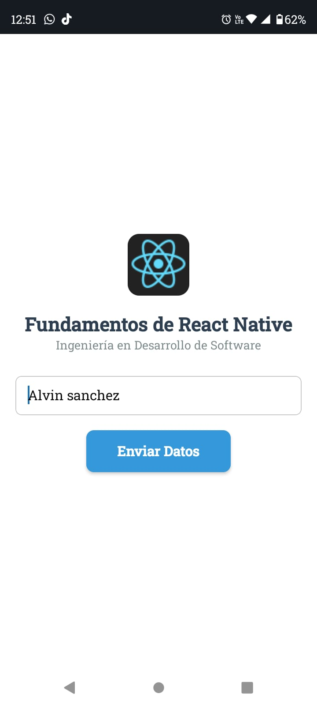

# Actividad: Fundamentos de React Native & Core Components 

Este proyecto es una introducción práctica a **React Native**, enfocada en el uso de componentes básicos, el sistema de estilos `StyleSheet` y el manejo de estados locales con Hooks.

## Objetivo de la Actividad
Desarrollar una interfaz interactiva que implemente los componentes estructurales de React Native, aplicando principios de diseño con **Flexbox** y validando la interacción con el usuario.

## Tecnologías Utilizadas
* **React Native** (Core Components)
* **Expo Go** (Entorno de desarrollo)
* **JavaScript** (ES6+)
* **Hooks** (`useState`)

## Características del Proyecto
- **Estructura Segura:** Uso de `SafeAreaView` para evitar colisiones con el notch y la barra de estado del dispositivo.
- **Layout con Flexbox:** Alineación centrada y diseño responsivo usando `flexDirection: 'column'`.
- **Interactividad:** Captura de datos mediante `TextInput` y respuesta visual con `Alert` y `TouchableOpacity`.
- **Estilos:** Implementación de bordes redondeados, sombras y márgenes optimizados para móviles.

## Evidencias de Funcionamiento

| Vista Inicial | Interacción | Resultado Final |
|---|---|---|
|  |  | 

## 💡 Aprendizajes Clave (Respuestas a la Actividad)
1. **StyleSheet vs CSS:** Se identificó que en React Native no existe la herencia en cascada y que todas las medidas son densidades de píxeles sin unidades (como `px` o `rem`).
2. **Componentes Nativos:** Se comprendió que `<View>` y `<Text>` son necesarios porque el proyecto se compila a código nativo de iOS/Android, no a HTML.
3. **Propiedad Flex:** El uso de `flex: 1` es fundamental para que la interfaz se adapte al tamaño completo de cualquier pantalla móvil.

---
**Desarrollado por:** Alvin - Estudiante de Ingeniería en Desarrollo de Software.